# LiquidLyf

LiquidLyf is a modern, youthful, and user-friendly **blood donation mobile application** designed to connect **donors** and **recipients** in real time.  
With a clean interface, smart matching system, and location-based search, LiquidLyf makes it easier than ever to **request blood** or **volunteer as a donor**.

---

## 📱 App Screenshots

### Main Activities
- **Main Activity**  
  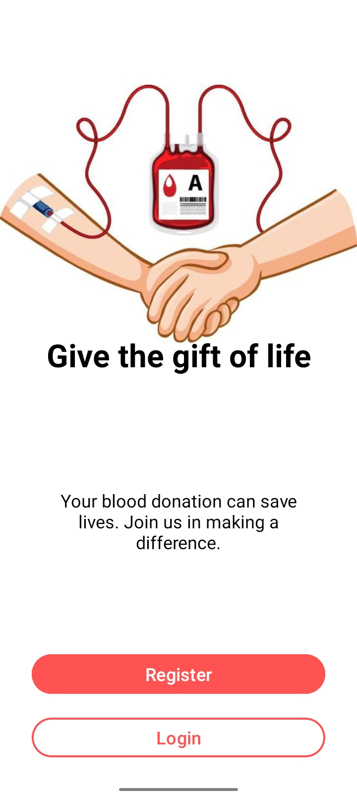  
  Entry point of the app, allowing users to either register or log in.

- **Login Activity**  
  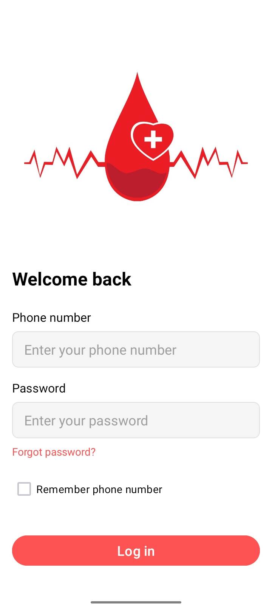  
  Enables registered users to log in with their phone number and password.

- **Register Activity**  
  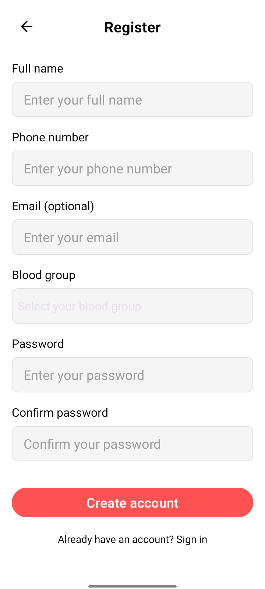  
  New users can create an account by providing details and selecting their blood group.

- **Request Blood Activity**  
  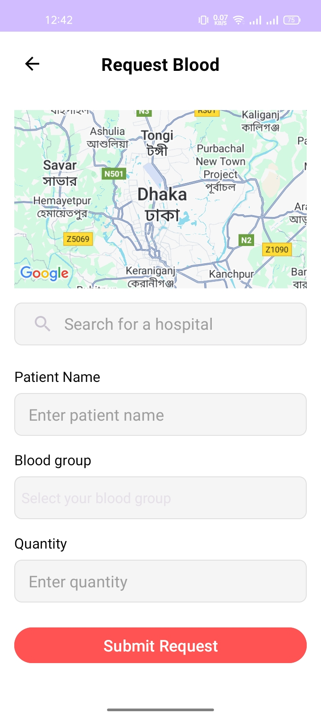  
  Provides a map and search bar to find hospitals and submit a blood request.

- **Update Profile Activity**  
  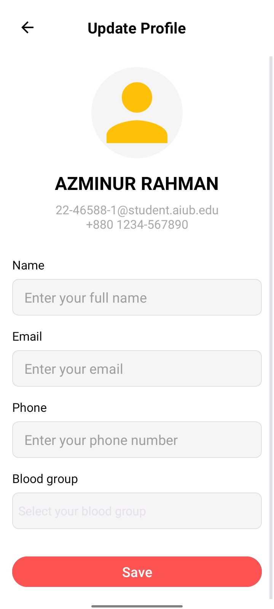  
  Allows users to update personal information like name, email, phone, and blood group.

- **Change Password Activity**  
  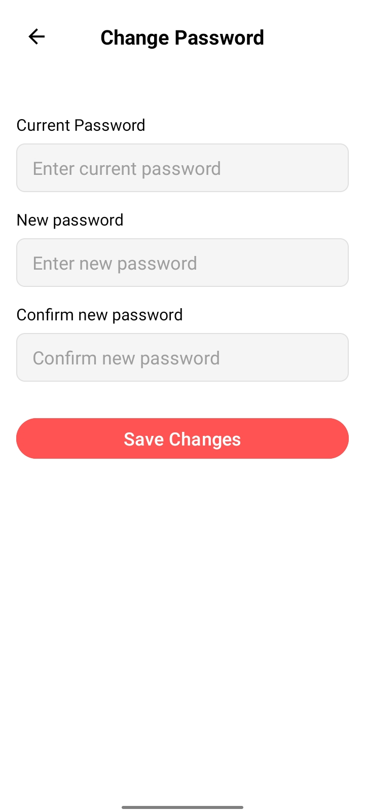  
  Lets logged-in users change their password by entering current and new passwords.

- **Forgot Password Phone Activity**  
  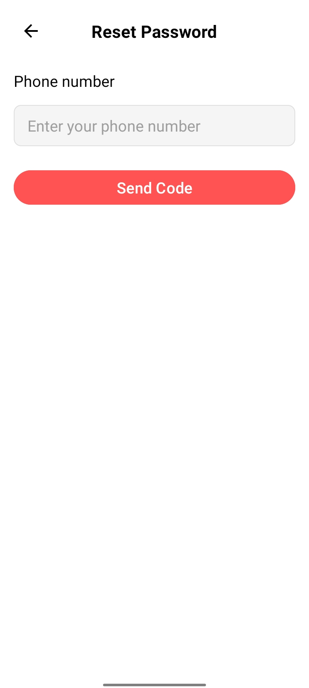  
  First step for resetting a forgotten password, requiring phone number input.

- **Forgot Password Verify Activity**  
  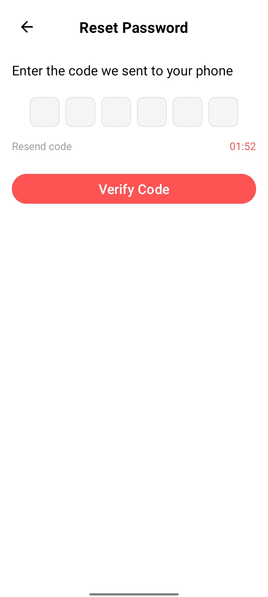  
  Users enter a verification code sent to their phone to confirm identity.

- **Forgot Password New Activity**  
  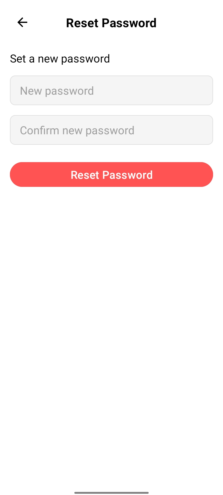  
  Allows setting a new password after successful verification.

---

### Fragments
- **Dashboard Fragment**  
  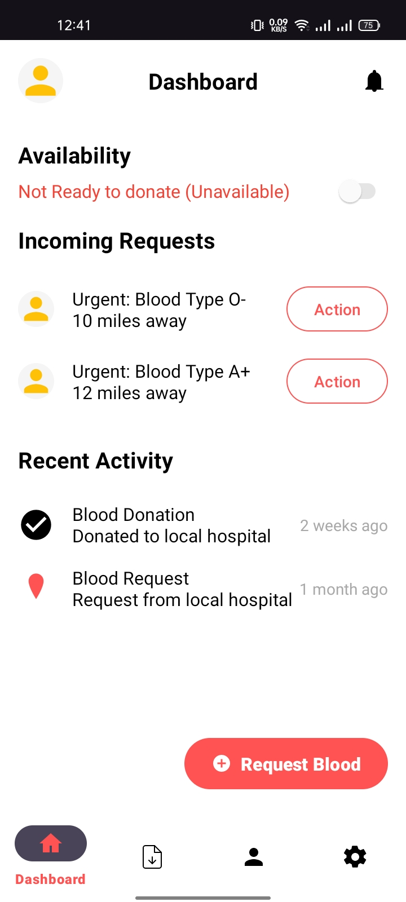  
  Shows availability status, incoming requests, and recent activity.

- **Requests Fragment**  
  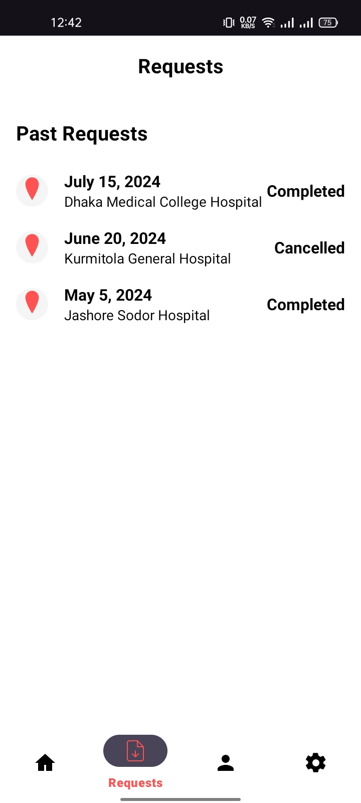  
  Displays a list of past blood requests with details.

- **Profile Fragment**  
  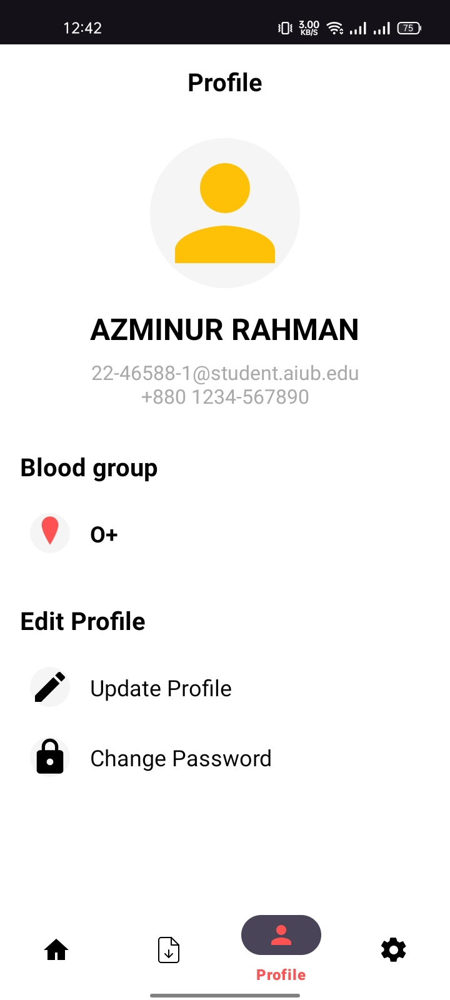  
  Shows user details with options to edit profile or change password.

- **Settings Fragment**  
  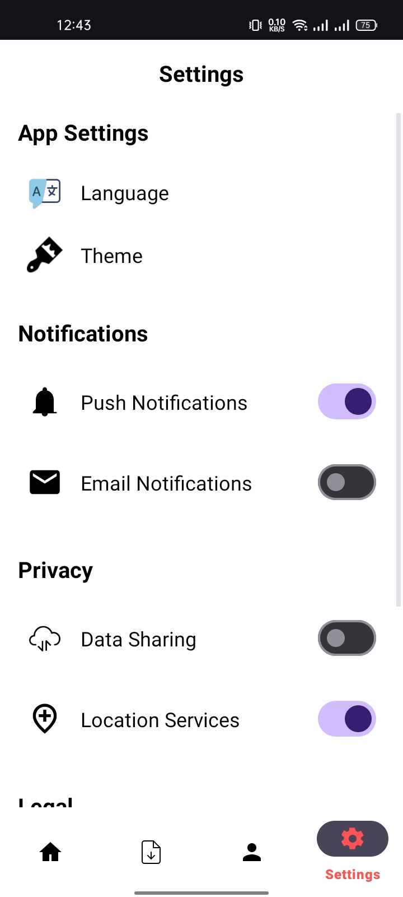  
  Contains notification, data sharing, location, and legal settings.

---

## 🚀 Features
- 📍 **Location-based donor matching** – Find donors near you quickly.
- 🔔 **Real-time notifications** – Instant alerts for urgent requests.
- 📅 **Donation history tracking** – Keep track of your past donations.
- 🧾 **Request management** – Create, accept, and respond to blood requests.
- 🌍 **Community impact stats** – See the lives saved together.

---

## 📱 Tech Stack
- **Frontend (Mobile App)**: Kotlin (Android)

---

## 🛠️ Installation
1. Clone this repository:
   ```bash
   git clone https://github.com/azminur2856/LiquidLyf.git
